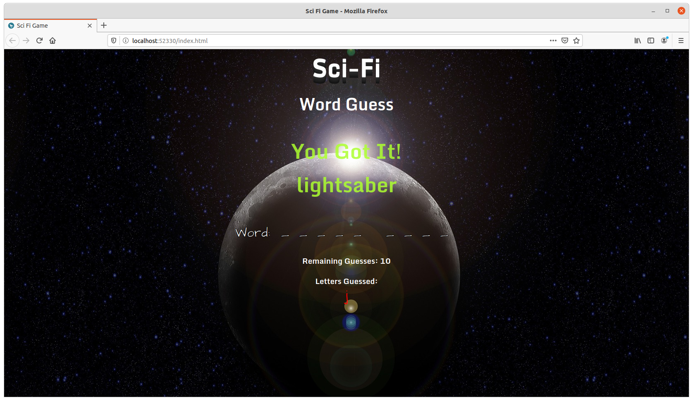
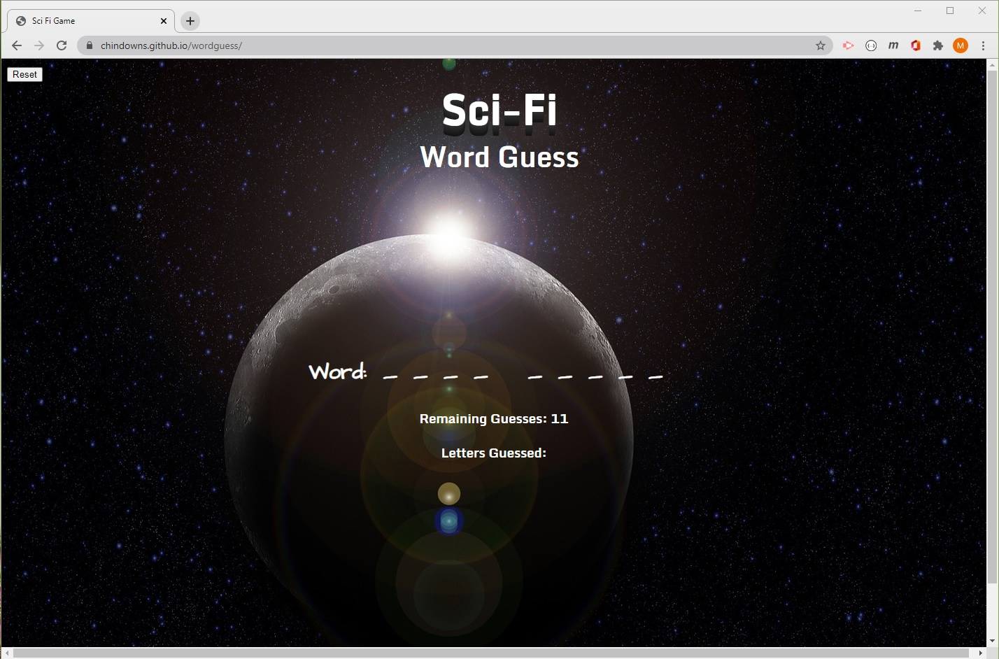

# Sci-Fi Word Guess
https://chindowns.github.io/wordguess

This is a fun wordguess game based on Sci-Fi.  Using HTML5, CSS, and Javascript the game allows the user to make 11 guesses before they lose and the game starts over.

## Site Image


## Table of Contents

- [Technologies Used](#Technologies-Used)
- [Learning Points](#Learning-Points)
- [Use](#Use)
- [Installation](#Installation)
- [Code Snippets](#Code-Snippets)
- [Usage](#Usage)
- [Acknowledgements](#Acknoledgements)
- [Authors](#Authors)

## Technologies Used
- Git - version control system for tracking changes to code
- Github - to host the repository
- JavaScript - JavaScript is a prototype-based object-oriented program language 
- CSS - for styles and page format.
- HTML - provides the basic structure for the website.

## Learning Points
- Built the app in a couple of hours with team of 5.  It is always fun to build with other people.  Everyone has a slightly different idea and address the task slightly differently.  This provides ample opportunity to learn to be flexible and improves my skill at reading/refactoring code.

### Modularizing functions
The first implication is to build this game in big function.  By breaking down the script to multiple functions helps to keep the code DRY.

```

```

## Dependencies
None

## Usage
Fork the repository ot simply copy the index.html, script.js and style.css file to your local drive. Run index.html in your local browser.

Change the words to guess by modifying the "words" array on line 9 of script.js.  HAVE FUN!




## Authors
    
[GitHub](https://github.com/analoo) Ana Medrano 

  
[GitHub](https://github.com/nadineb1160) Nadine Bundschuh

   [GitHub](https://github.com/PopSizzle) Sam Poppe   


[GitHub](https://github.com/kaseychang77) Kasey Chang

   
[GitHub](https://github.com/chindowns) Michael Downs 

